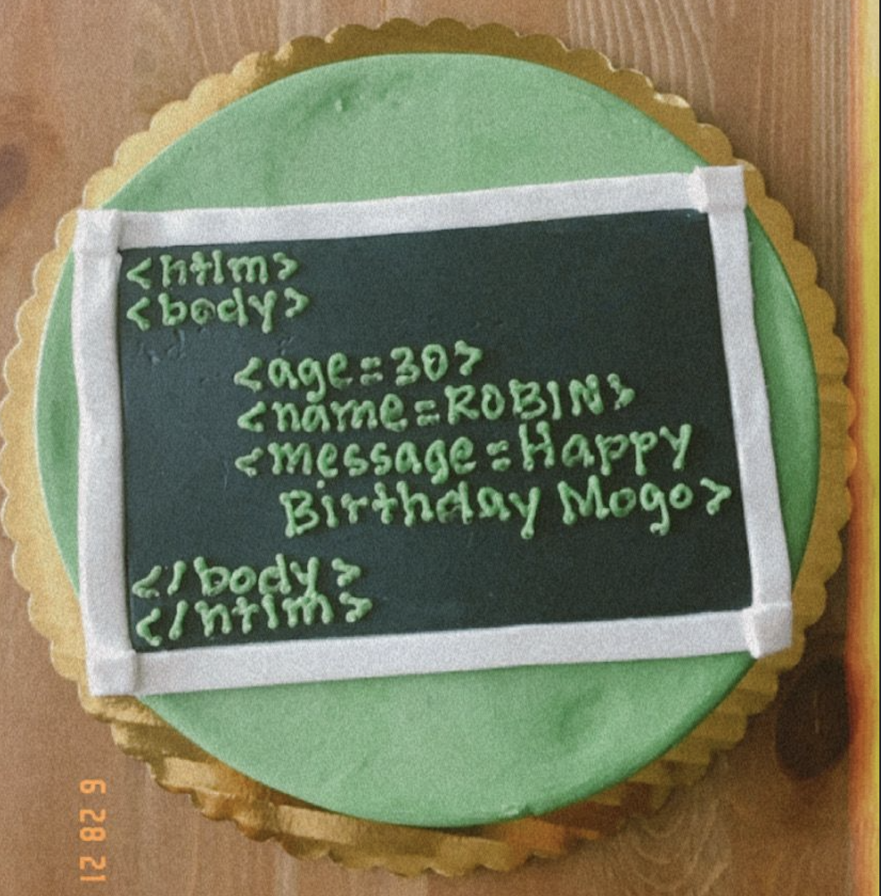

# fix-birthday-html

Simple script that fixes small typo (htlm) on my 30th birthday cake 🎂 and produces a readable HTML code.

## How to use it

```bash
python main.py your_htlm_file
```

## Original

```html
<htlm>
<body>
    <age=30>
    <name=ROBIN>
    <message=Happy
     Birthday Mogo>
</body>
</htlm>
```

## Output

```html
<html>

<body>
    <p>
        <b>age:</b>
        <span>30</span>
    </p>
    <p>
        <b>name:</b>
        <span>ROBIN</span>
    </p>
    <p>
        <b>message:</b>
        <span>Happy Birthday Mogo</span>
    </p>
</body>

</html>
```

## The Cake


